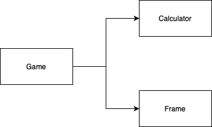

# 볼링 게임
TDD 연습용

## 요구사항
- 볼링 게임은 10개의 프레임으로 구성된다.
- 각 프레임은 대개 2 롤을 갖는다(10개의 핀을 쓰러 뜨리기 위해 2번의 기회를 갖는다).
- Spare: 10 + next first roll에서 쓰러 뜨린 핀수.
- Strike: 10 + next two rolls에서 쓰러 뜨린 핀수.
- 9번째 프레임에서 스트라이크가 발생했다면 11번째 프레임에서 한번 더 던질수 있다
- 10번째 프레임에서 스페어나 스트라이크가 발생했다면 2번의 볼링공을 더 굴릴 수 있다

## 설계

## 코딩 규약
- depth 2 이하
- else 문 사용 금지
- 메소드 길이 최대한 짧게
- 원시값 포장
- 일급 콜렉션 사용
